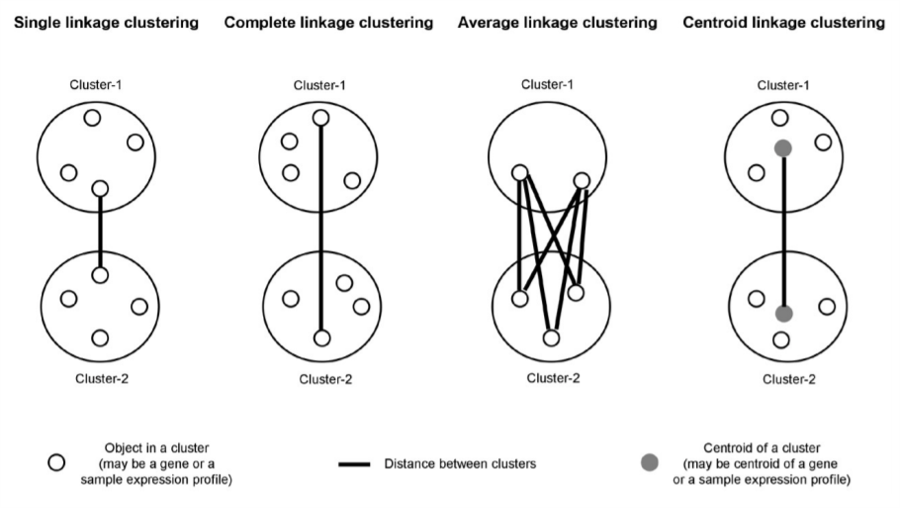

```{r setup, include=FALSE}
knitr::opts_chunk$set(echo = TRUE)
```

## K-Means {.tabset}

### Create a Simulated Dataset

We begin with a simple simulated example in which there are **truly two clusters** in the
data; the first 25 observations have a mean shift relative to the next 25
observations. This makes sure we have to distinct clusters in our data.

```{r}
par(mfrow=c(1,2))
set.seed(2)
x <- matrix(rnorm (50*2), ncol=2) # Create a 50 X 2 matrix with samples from a 
                               # normal distribution
plot(x, main = 'Before Shift')

x[1:25,1] <- x[1:25,1]+3   # Move half the points 3 units right and 
x[1:25,2] <- x[1:25,2]-4   # 4 units down

plot(x,main = 'After Shift')
```

### The Model

To perform *K-Means* clustering we use the function <span style="color:red">**kmeans()**</span> (built-in with *stats* 
package).

We now perform *K-means* clustering with K = 2, which is the number of clusters (groups)
we want to separate our data into. The number of clusters has to be specified before 
the model is run. *This is one of the draw backs about K-Means clustering*.

After the model is run, we call the argument km.out$cluster to display the cluster label for each observation in our simulated data set.


```{r}
km.out <- kmeans (x,2, nstart =20) # kmeans(x, centers, iter.max = 10, nstart = 1,
                                   # algorithm = c("Hartigan-Wong", "Lloyd", "Forgy",
km.out$cluster                     # "MacQueen"), trace=FALSE)

```


The K-means clustering perfectly separated the observations into two clusters even though we did not supply any group information to <span style="color:red">**kmeans()**</span>. We
can plot the data, with each observation colored according to its cluster
assignment.

```{r}
plot(x, col=(km.out$cluster +1), 
  main="K-Means Clustering Results with K=2", 
  xlab="", ylab="", pch=20, cex=2)
text(x, labels=km.out$cluster,cex=0.9, font=10,pos=4)
```


Here the observations can be easily plotted because they are **two-dimensional**.
If there were more than two variables then we could instead perform PCA
and plot the first two principal components score vectors. 

Alternatively, we can use the it using <span style="color:red">**fviz_cluster**</span>. This provides a nice illustration of the clusters. If there are more than two dimensions (variables) <span style="color:red">**fviz_cluster**</span> will perform principal component analysis (PCA) and plot the data points according to the first two principal components that explain the majority of the variance. *This function is not in the textbook lab.

```{r}
library(factoextra)
set.seed(2)
df <- matrix(rnorm (50*3), ncol=3)   # Create a 50 X 3 matrix
                                          
df[1:25,1] <- df[1:25,1]+3  
df[1:25,2] <- df[1:25,2]-4 
df[1:25,3] <- df[1:25,3]+3 

km.out <- kmeans (df,2, nstart =20)
fviz_cluster(km.out, data = df)
```

In this example, we knew that there really were two clusters because
we generated the data. However, for real data, in general we do not know
the true number of clusters. 

We could instead have performed K-means clustering on this example with K = 3, for 
example

```{r}
set.seed(4)
km.out <- kmeans (x,3, nstart = 20)
km.out
```

When K = 3, *K-means* clustering splits up the two clusters in order try create another 
distinct group.
```{r}
plot(x, col=(km.out$cluster +1), 
  main="K-Means Clustering Results with K=2", 
  xlab="", ylab="", pch=20, cex=2)
text(x, labels=km.out$cluster,cex=0.9, font=10,pos=4)
```

### Additional Parameters and Tuning

To run the kmeans() function in R with multiple initial cluster assignments, we use the <span style="color:red">**nstart**</span> argument. If a value of <span style="color:red">**nstart**</span> greater than one
is used, then K-means clustering will be performed using multiple random
assignments in Step 1 of Algorithm 10.1,

**'K-Means Clustering'** (p.g. 388)

1. *Randomly assign a number, from 1 to K, to each of the observations. These server as initial cluster assignments for the observations.*

and the <span style="color:red">**kmeans()**</span> function will
report only the best results. Here we compare using <span style="color:red">**nstart=1**</span> 
to <span style="color:red">**nstart=20**</span>. We can also think of this as the number
of times we wish to perform K-Means Clustering since its based on random initialization.

```{r}
set.seed(4)
km.out <- kmeans (x, centers = 3, nstart =1) # nstart: if centers is a number how 
                                  #         many random sets should be chosen?
km.out$tot.withinss
```

```{r}
set.seed(4)
km.out <- kmeans (x, centers = 3, nstart =20)
km.out$tot.withinss
```

Note that km.out\$tot.withinss is the total within-cluster sum of squares,
which we seek to minimize by performing K-means clustering (Equation
10.11).
$$\underset{C_1,\ldots,C_K}{\text{minimize}}\left\{\sum_{k=1}^K\frac{1}{|C_K|}\sum_{i,i' \in C_k} \sum_{j=1}^p(x_{ij}-x_{i'j})^2 \right\}$$

The individual within-cluster sum-of-squares are contained in the
vector <span style="color:red">**km.out$withinss**</span>.

It is recommend to always running *K-means* clustering with a large
value of nstart, such as 20 or 50, to minimize the chance of getting a undesirable
local optimum.
When performing K-means clustering, in addition to using multiple initial cluster assignments, it is also important to set a random seed using the
set.seed() function. This way, the initial cluster assignments in Step 1 can
be replicated, and the K-means output will be fully reproducible.

#### Tune the optimal number of clusters (k)

Create a vector to store 15 totwithiness scores
```{r}
kmax <- 15
totwithiness<-rep(0,kmax)
```


Tune k = 1 to 15
```{r}
for (k in 1:kmax)
{
  totwithiness[k] = kmeans(x, 
                           k, # number of clusters
                           nstart=25,
                           iter.max = 15 # maximum number of iterations allowed
                           )$tot.withinss
}
```


Scree plot: tot.withinss by k
```{r}
plot(1:kmax, totwithiness,
     type="b", pch = 19, frame = FALSE, 
     xlab="Number of clusters K",
     ylab="Total within-clusters sum of squares",
     xlim = c(0,kmax+1),
     ylim = c(0,max(totwithiness)))

# below is just to highlight elbow on graph #
axis(1:kmax)
par(new=TRUE)
plot(2,totwithiness[2], ylim = c(0,max(totwithiness)), xlim = c(0,kmax+1),
     xlab = "", ylab = "", pch = 1, col ="blue", cex = 3)
```


## Hierarchical Clustering {.tabset}
The <span style="color:red">**hclust()**</span> function implements hierarchical clustering in R. In the following example, we use the data from above to plot the hierarchical clustering dendrogram using complete, single, and average linkage clustering, with Euclidean distance as the dissimilarity measure.

We begin by clustering observations using complete linkage. The <span style="color:red">**dist()**</span> function is used to compute the 50 × 50 inter-observation Euclidean distance matrix.

```{r}
hc.complete <- hclust(dist(x), method="complete") # tells type of cluster method, type of distance used, and total data points
```

We could just as easily perform hierarchical clustering with average or single linkage instead:

```{r}
hc.average <- hclust(dist(x), method ="average")
hc.single <- hclust(dist(x), method ="single")
```

We can now plot the dendrograms obtained using the usual <span style="color:red">**plot()**</span> function.The numbers at the bottom of the plot identify each observation.
```{r, echo=FALSE,out.height="40%", fig.cap="https://www.mrc-lmb.cam.ac.uk/genomes/madanm/microarray/chapter-final.pdf"}

```


```{r pressure}
par(mfrow=c(1,3))
plot(hc.complete ,main="Complete Linkage ", xlab="", sub="",
cex=.9, col = "deepskyblue") # produces a cleaner plot that is easy to follow

plot(hc.average , main="Average Linkage", xlab="", sub="",
cex=.9, col = "goldenrod3")

plot(hc.single , main="Single Linkage", xlab="", sub="",
cex=.9, col = "darkseagreen") # produces branches for every single observation. Not the most comprehensive heirachrical plotting method
```

To determine the cluster labels for each observation associated with a given cut of the dendrogram, we can use the <span style="color:red">**cutree()**</span> function:

```{r}
cutree(hc.complete , 2) # Shows complete separation of clusters classes
plot(hc.complete ,main="Complete Linkage ", xlab="", sub="",
cex=.9)
abline(h= 7, col = "red", lty = "dashed")
```

```{r}
cutree(hc.average , 2)
plot(hc.average , main="Average Linkage", xlab="", sub="",
cex=.9)
abline(h= 4, col = "red", lty = "dashed")
```

```{r}
cutree(hc.single , 2)
plot(hc.single , main="Single Linkage", xlab="", sub="",
cex=.9)
abline(h= 1.39, col = "red", lty = "dashed")
```

For this data, complete and average linkage generally separate the observations into their correct groups. However, single linkage identifies one point as belonging to its own cluster. A more sensible answer is obtained when four clusters are selected, although there are still two singletons.


```{r}
cutree(hc.single , 4)
plot(hc.single , main="Single Linkage", xlab="", sub="",
cex=.9)
abline(h= 1.25, col = "red", lty = "dashed")

```

To scale the variables before performing hierarchical clustering of the observations, we use the <span style="color:red">**scale()**</span> function:

```{r,out.width="110%"}
xsc=scale(x)
plot(hclust(dist(xsc), method ="complete"), main=" Hierarchical
Clustering with Scaled Features ")
```

Correlation-based distance can be computed using the <span style="color:red">**as.dist()**</span> function, which converts an arbitrary square symmetric matrix into a form that the <span style="color:red">**hclust()**</span> function recognizes as a distance matrix. However, this only makes sense for data with at least three features since the absolute correlation between any two observations with measurements on two features is always 1. Hence, we will cluster a three-dimensional data set

```{r,out.width="110%"}
x=matrix(rnorm (30*3), ncol=3)
dd=as.dist(1-cor(t(x)))
plot(hclust(dd, method ="complete"), main=" Complete Linkage
with Correlation -Based Distance", xlab="", sub ="")
```


## Applied Exercise No. 9

We will be using the <span style="color:red">**USArrests**</span> data set from
the *ISLR* library.

```{r}
library(ISLR)
```


#### a.) Using hierarchical clustering with complete linkage and Euclidean distance, cluster the states.

```{r,out.width="120%"}
set.seed(5082)
hcluster.complete <- hclust(dist(USArrests), method = "complete")
plot(hcluster.complete)
```

#### b.) Cut the dendrogram at a height that results in three distinct clusters. Which states belong to which clusters?
```{r}
# cutree(tree, k = NULL, h = NULL) , can speicify clusters (k) or dissimilarity
# height (h).
cutree(hcluster.complete, k = 3)
```

```{r}
table(cutree(hc.complete, 3))
```

#### c.) Hierarchically cluster the states using complete linkage and Euclidean distance, after scaling the variables to have standard deviation one.

```{r,out.width="120%"}
# First we scale the data -- similar to PCR
scaledData <- scale(USArrests)
hscaled.complete <- hclust(dist(scaledData), method = "complete")
plot(hscaled.complete)
```


#### d.) What effect does scaling the variables have on the hierarchical clustering obtained? In your opinion, should the variables be scaled before the inter-observation dissimilarities are computed? Provide a justification for your answer.

```{r}
cutree(hscaled.complete, 3)
```

```{r}
table(cutree(hscaled.complete, 3))
```

We can compare the difference between scaled and unscaled versions.

```{r}
table(cutree(hscaled.complete, 3), cutree(hcluster.complete, 3))
```


Observations from scaling the variables:

* The max height of the dendrogram obtained from hierarchical clustering becomes smaller. 
* From a cursory glance, it doesn’t effect the bushiness of the tree obtained. 
* Affects the clusters obtained from cutting the dendrogram into 3 clusters.

The data should be standardized because the data measured has different units (UrbanPop compared to other three columns).


## References

* Babu, M. M., & Grant, R. (n.d.). Computational Genomics. Horizon Press.

